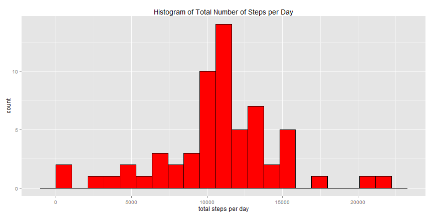

# Reproducible Research: Peer Assessment 1
  
  
## Loading and preprocessing the data

To load the data we assume the file 'activity.zip' is already in your working directory:


```r
data <- read.csv(unz('activity.zip', 'activity.csv'), header=T, na.strings='NA')
```
  
  
## What is mean total number of steps taken per day?

First we compute the total number of steps taken per day and give meaningful names for the variables
in the aggregated data set:


```r
data_to_plot1 <- aggregate(data$steps~data$date, data=data, FUN=sum)
names(data_to_plot1) <- c('date', 'total.steps')
```

We now make a histogram of the total number of steps taken each day. For this and subsequent plotting
we use the R ggplot2 package:


```r
library(ggplot2)
binwidth <- diff(range(data_to_plot1$total.steps))/20
ggplot(data_to_plot1, aes(x=total.steps)) +
  geom_histogram(binwidth=binwidth, fill='orange', colour='black') +
  labs(x='total steps per day', title='Histogram of Total Number of Steps per Day')
```


Now we display the mean and median total number of steps taken per day through the R summary
function:


```r
summary(data_to_plot1$total.steps, digits=max(data_to_plot1$total.steps)+2)
```

```
##    Min. 1st Qu.  Median    Mean 3rd Qu.    Max. 
##      41    8841   10765   10766   13294   21194
```
  
  
## What is the average daily activity pattern?

We first compute the average number of steps by day by 5-minute interval and give meaningful names
for the variables in the aggregated data set:


```r
data_to_plot2 <- aggregate(data$steps~data$interval, data=data, FUN=mean)
names(data_to_plot2) <- c('interval', 'average.steps')
```

Here we define a function named 'timeFormat', wich receives the raw value of the 5-minute interval
(numeric) and converts it to a string formatted as 'hh:mm' to be used in the plotting:


```r
timeFormat <- function(x) {
  format(strptime(sprintf('%04d', x), format='%H%M'), '%H:%M')
}
```

Now we compute the maximum number of steps, on average, accross all days, and its corresponding
5-minute interval. We also create a label whith those values to be shown on the plotting:


```r
data_to_plot2_max <- data_to_plot2[data_to_plot2[,2]==max(data_to_plot2$average.steps),]
label <- paste(' maximum average number of steps:\n', round(data_to_plot2_max$average.steps), '@',
  timeFormat(data_to_plot2_max$interval), '5-minute interval')
```

And finally we plot the time series of the average number of steps taken, averaged across all days, by the corresponding 5-minute interval, showing also the average maximum number of steps:


```r
ggplot(data_to_plot2, aes(x=interval, y=average.steps)) +
  scale_x_continuous(labels=timeFormat) +
  geom_line(colour='blue', size=1) +
  geom_hline(yintercept=data_to_plot2_max$average.steps, linetype='dashed') +
  geom_vline(xintercept=data_to_plot2_max$interval, linetype='dashed') +
  geom_point(x=data_to_plot2_max$interval, y=data_to_plot2_max$average.steps, size=4) +
  annotate(geom='point', x=1000, y=175, size=4) +
  annotate(geom='text', x=1050, y=175, label=label, size=5, hjust=0) +
  labs(x='5-minute interval', y='average number of steps', title='Average Number of Steps Across All
  Days by the Corresponding 5-Minute Interval')
```


  
  
## Imputing missing values

Total number of missing values in the data set:


```r
number_missing_values <- nrow(data) - nrow(na.omit(data))
cat('number of missing values: ', number_missing_values)
```

```
## number of missing values:  2304
```

We fill in missing values using the average number of steps by day by 5-minute interval, which was
calculated before. Then we create a new data frame 'data_na_filled' with missing values filled in
according to that strategy:


```r
data_na <- data[is.na(data),]
data_na_filled <- merge(data_to_plot2,data_na[,2:3],by='interval',all=T)
data_na_filled <- data.frame(steps=data_na_filled$average.steps, date=data_na_filled$date,
  interval=data_na_filled$interval)
data_na_filled <- rbind(na.omit(data), data_na_filled)
```

Then we compute the total number of steps taken per day and give meaningful names for the variables
in the aggregated data set:


```r
data_to_plot3 <- aggregate(data_na_filled$steps~data_na_filled$date, data=data_na_filled, FUN=sum)
names(data_to_plot3) <- c('date', 'total.steps')
```

We now make a histogram of the total number of steps taken each day:


```r
binwidth <- diff(range(data_to_plot3$total.steps))/20
ggplot(data_to_plot3, aes(x=total.steps)) +
  geom_histogram(binwidth=binwidth, fill='red', colour='black') +
  labs(x='total steps per day', title='Histogram of Total Number of Steps per Day')
```



Now we display the mean and median total number of steps taken per day through the R summary
function:


```r
summary(data_to_plot3$total.steps, digits=(max(data_to_plot1$total.steps)+2))
```

```
##    Min. 1st Qu.  Median    Mean 3rd Qu.    Max. 
##      41    9819   10766   10766   12811   21194
```

We can see that the mean does not change because we are filling NAs with the corresponding average 
number of steps for each 5-minute interval; median changes only slightly, because we are introducing 
values for the steps taken on 8 different dates that had NAs in the original data set:


```r
print(data_to_plot3[!(data_to_plot3$date %in% data_to_plot1$date),])
```

```
##          date total.steps
## 1  2012-10-01       10766
## 8  2012-10-08       10766
## 32 2012-11-01       10766
## 35 2012-11-04       10766
## 40 2012-11-09       10766
## 41 2012-11-10       10766
## 45 2012-11-14       10766
## 61 2012-11-30       10766
```
  
  
## Are there differences in activity patterns between weekdays and weekends?

First we add a new factor variable to data set to indicate if date corresponds to weekday or weekend:


```r
days <- weekdays(as.Date(data_na_filled$date))
days_type <- rep('weekday', length(days))
days_type[days=='Saturday'] <- 'weekend'
days_type[days=='Sunday'] <- 'weekend'
days_type <- as.factor(days_type)
data_na_filled <- cbind(data_na_filled, days.type=days_type)
```

Then we compute the average number of steps by day by 5-minute interval and give meaningful names for
the variables in the aggregated dataset:


```r
data_to_plot4 <- aggregate(data_na_filled$steps~data_na_filled$interval+data_na_filled$days.type, 
  data=data_na_filled, FUN=mean)
names(data_to_plot4) <- c('interval', 'days.type', 'average.steps')
```

Finally we plot two time series of the average number of steps taken, averaged across all days, by
the corresponding 5-minute interval. One plotting for each day type (weekday and weekend), stacked in
a panel plot:


```r
ggplot(data_to_plot4, aes(x=interval, y=average.steps, colour=days.type)) +
  scale_x_continuous(labels=timeFormat) +
  geom_line(colour='darkgreen') +
  facet_wrap(~ days.type, nrow=2) +
  labs(x='5-minute interval', y='average number of steps', title='Average Number of Steps Across All 
  Days by the Corresponding 5-Minute Interval and Day Type')
```


We can see a higher level of activity (more steps) on weekdays arround 08:30. On weekends, we see
less activity arround 08:30 but the activity is higher at other periods of the day.
